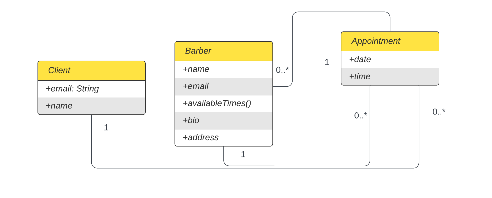

# FadeFinder

## Build Instructions

- After you pull run `npm install` in /react-frontend and then agian in /expressjs-backend

- You'll need a 2 terminals to run the app, running `npm start` in both /react-frontend and /expressjs-backend

## Style

- See `UI_design-13.pdf` to see the first UI design

- Style guide used: React/JavaScript (airbnb)

- IDE plugins used: Visual Studio Code (ESlint, prettier); allow "Format on Save" option in IDE settings; `npm run format` in project root folder
  recursively formats .js, .jsx, .css, .md, .json files

## Class Diagram

- Appointments are outermost container for clients and barbers

- currently, clients are only stored in barber objects

## Testing

- run `npm test` in /expressjs-backend to run jest

- code converage is at 75% at time of writing